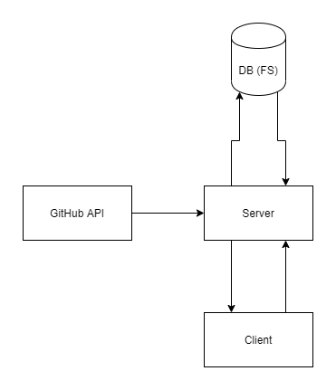

## Github Search

Search for github respositories and issues. Filters available based on labels such as 'bug', or programming languages, save data to file system by adding repos to 'Starred'.

Using the Github API V.3 (REST).
React frontend + Express backend.
fs (FileSystem) to save data

 

## Getting started:

CLIENT: In the project directory, cd into client and run:

### `npm i && npm start`

SERVER: In the project directory, cd into client and run:

### `npm i && npm run dev`

Minimal styling using React bootstrap.

 

